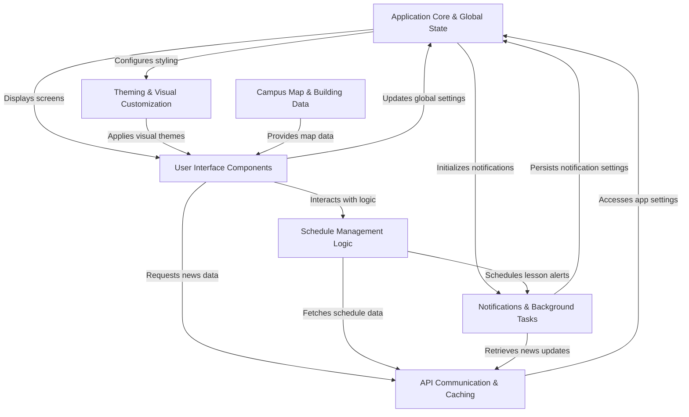
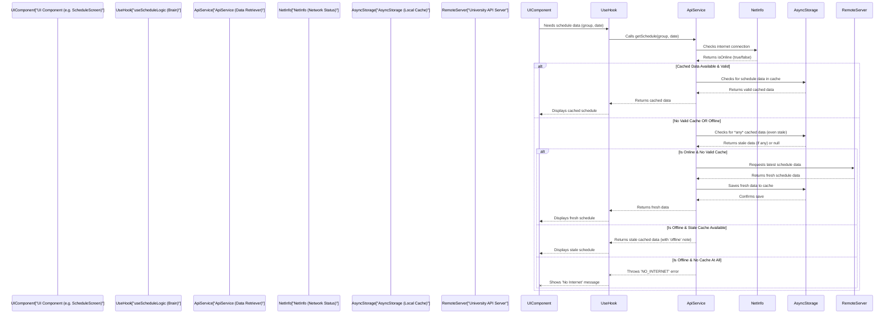
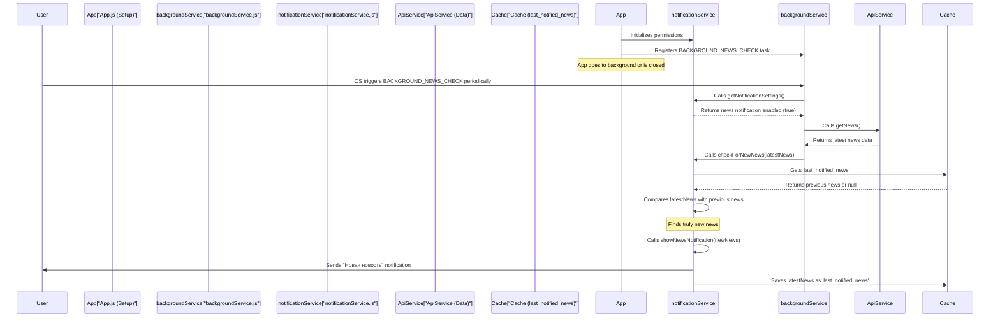

<div align="center">
  <a href="https://myiti.pro100byte.ru/">
    
  </a>

   <p></p>

  <p>
    <a href="https://github.com/PRO100BYTE/MyKHSU/releases">
      
    </a>
    <a href="https://www.gnu.org/licenses/lgpl-3.0.ru.html">
      
    </a>
    <a href="https://reactnative.dev/">
      
    </a>
    <a href="https://expo.dev/">
      
    </a>
    <a href="https://developer.mozilla.org/ru/docs/Web/JavaScript">
      
    </a>
  </p>
</div>

---

#

# Мой ИТИ ХГУ - Твой университет в кармане

## 📖 О проекте

**Мой ИТИ ХГУ** — это официальное мобильное приложение для студентов и преподавателей Инженерно-технологического института Хакасского государственного университета им. Н. Ф. Катанова. Приложение создано для того, чтобы сделать доступ к расписанию, новостям и навигации по университету максимально удобным и быстрым.

## ✨ Основные возможности

### 🎓 Для студентов

- **Расписание**: Просмотр расписания занятий по группам.
- **Режимы**: Дневной и недельный просмотр.
- **Первокурснику**: Специальный раздел с полезной информацией, ссылками и гайдами.

### 👨‍🏫 Для преподавателей

- **Персональное расписание**: Поиск по ФИО.
- **Детализация**: Отображение групп для каждой пары.
- **Навигация**: Удобный просмотр расписания на неделю.

### 🚀 Общие функции

- **Офлайн-доступ**: Кэширование расписания и новостей.
- **Новости**: Актуальные события университета.
- **Карта**: Интерактивная схема корпусов.
- **Персонализация**: Темы (светлая/тёмная) и цветовые акценты.
- **Уведомления**: Оповещения об изменениях и важных новостях.

## 🛠 Технический стек

Проект построен с использованием современных технологий:

- **Framework**: [React Native](https://reactnative.dev/)
- **Platform**: [Expo](https://expo.dev/)
- **Language**: [JavaScript (ES6+)](https://developer.mozilla.org/ru/docs/Web/JavaScript)
- **Navigation**: Expo Router (File-based routing)

## 🗒️ Структура проекта



## 👀 Как приложение работает с API для отображения расписания и кэширования?



## 🛜 Работа приложения в фоне (для работы службы уведомлений)



## 🚀 Запуск и разработка

### Предварительные требования

- Node.js
- npm
- Git

### Установка и запуск

1. **Склонируйте репозиторий**

   ```bash
   git clone https://github.com/PRO100BYTE/MyKHSU.git
   cd MyKHSU
   ```

2. **Установите зависимости**

   ```bash
   npm install
   ```

3. **Запустите сервер разработки**

   ```bash
   npx expo start
   ```

В результате, вы получите варианты запуска приложения в:

- [тестовой сборке](https://docs.expo.dev/develop/development-builds/introduction/)
- [Android эмуляторе](https://docs.expo.dev/workflow/android-studio-emulator/)
- [iOS симуляторе](https://docs.expo.dev/workflow/ios-simulator/)
- [Expo Go](https://expo.dev/go)

## 📦 Сборка приложения

### Android

Для начала нужно создать prebuild:

```bash
npx expo prebuild
```

Затем выполните одну из команд:

```bash
# APK (Release)
npx eas build --platform android --profile release-apk --local

# AAB (Google Play)
npx eas build --platform android --profile release --local

# Development APK
npx eas build --platform android --profile development --local
```

> [!WARNING]
> Для локальной сборки под Android требуется Linux или macOS.

> [!NOTE]
> **Комментарий TheDayG0ne:**
> *Лично я для сборки приложения использую виртуальную машину с ОС Ubuntu Server 24.04. В качестве окружения устанавливал git, nodejs, jdk, а также android-sdk.*

### iOS

Для начала нужно создать prebuild:

```bash
npx expo prebuild
```

Затем выполните одну из команд:

```bash
# Release (IPA)
npx eas build --platform ios --profile release --local

# Development (Device)
npx eas build --platform ios --profile development --local
```

> [!WARNING]
> Для локальной сборки под iOS требуется macOS с установленным Xcode.

## 📚 Полезные ресурсы

- [Документация Expo](https://docs.expo.dev/)
- [Учебное пособие Expo](https://docs.expo.dev/tutorial/introduction/)

## 🤝 Вклад в развитие

Мы приветствуем вклад сообщества! Пожалуйста, ознакомьтесь с [CONTRIBUTING.md](CONTRIBUTING.md) и [CODE_OF_CONDUCT.md](CODE_OF_CONDUCT.md) перед началом работы.

## 📄 Лицензия

Этот проект распространяется под лицензией LGPL v3. Подробнее см. в файле [LICENSE.md](LICENSE.md).

---
<div align="center">
  <sub>Разработано с ❤️ командой PRO100BYTE</sub>
</div>
