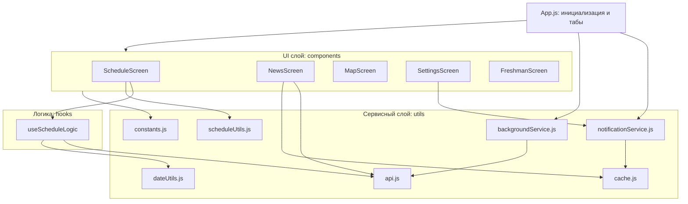
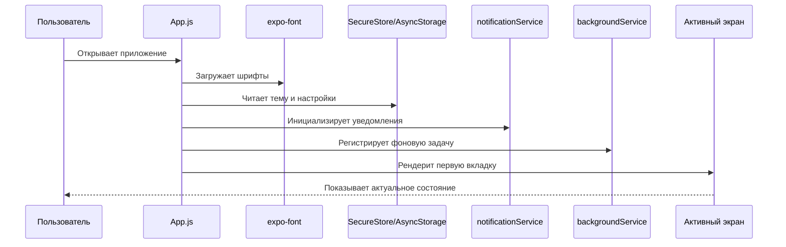
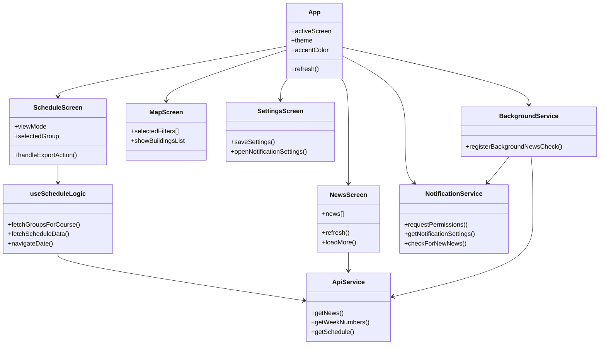

# Архитектура приложения

## Технологический стек

- React Native 0.81
- Expo 54
- React 19
- AsyncStorage и SecureStore для локальных данных
- Expo Notifications и Expo Background Fetch для уведомлений и фоновых задач
- Sentry для мониторинга ошибок

## Точка входа и композиция приложения

- Точка входа: `App.js` + `index.js`.
- `App.js` отвечает за:
  - загрузку шрифтов и первичный загрузочный экран;
  - управление темой и акцентным цветом;
  - переключение основных экранов через таб-бар;
  - инициализацию уведомлений, фоновой логики и интеграции Sentry.

Основной порядок вкладок определяется константой `TAB_ORDER` в `App.js`:

- расписание;
- карта;
- первокурснику / студенту;
- новости;
- настройки.

## Слои ответственности

### 1. UI-слой: `components/`

Компоненты отвечают за:

- рендер интерфейса;
- интеракции пользователя;
- локальные анимации и визуальное состояние.

Критичные экраны:

- `ScheduleScreen.js`: расписание, экспорт, заметки, дедлайны ДЗ, избранное, посещаемость, свободные аудитории с выбором недели/дня/пары.
- `NewsScreen.js`: лента новостей, пагинация, refresh, поиск, fallback на кэш.
- `MapScreen.js`: карта корпусов, фильтры, маршруты и список объектов.
- `SettingsScreen.js`: параметры темы, уведомлений, учебного профиля, истории изменений и системных функций.
- `AcademicCalendarScreen.js`: учебные события, добавление из панели действий фильтров, редактирование и экспорт в календарь и ICS.
- `AcademicEventModal.js`: модальное окно создания и редактирования учебного события.
- `ScheduleChangesHistoryScreen.js`: отдельная история изменений расписания с diff-представлением.

### 2. Логический слой: `hooks/`

- `useScheduleLogic.js` инкапсулирует состояние расписания:
  - курс, группы, текущая неделя или дата;
  - онлайн или оффлайн статус;
  - загрузка расписания и времени пар;
  - переходы по датам и обновление данных.

Принцип: экран остается тонким, бизнес-логика выносится в хук или утилиты.

### 3. Сервисный слой: `utils/`

- `api.js`: сетевые вызовы и адаптация ответов.
- `cache.js`: TTL-кэш с валидацией и очисткой поврежденных записей.
- `notificationService.js`: разрешения, настройки и логика уведомлений.
- `backgroundService.js`: регистрация и выполнение фоновой проверки новостей.
- `favoritesStorage.js`: избранные сущности расписания.
- `attendanceStorage.js`: хранение и агрегирование посещаемости с ключом по дате и типу пары.
- `academicEventsStorage.js`: локальное хранилище учебных событий.
- `studyProfileStorage.js`: локальное хранилище учебного профиля.
- `dateUtils.js`, `scheduleUtils.js`: вспомогательные вычисления дат и состояний расписания.
- `constants.js`: централизованные константы приложения.

## Потоки данных

### Поток расписания

1. Пользователь выбирает режим и фильтры на экране расписания.
2. `ScheduleScreen.js` использует `useScheduleLogic.js`.
3. Хук запрашивает данные через `utils/api.js`.
4. При сетевых проблемах используется fallback на кэш или локальные данные.
5. Экран показывает статус загрузки, ошибки и состояние кэша.

### Поток новостей

1. `NewsScreen.js` запрашивает новости через API.
2. Новости очищаются, нормализуются и дедуплицируются.
3. При недоступной сети применяется кэш, статус передается в хедер.
4. Фоновая задача может проверить наличие новых новостей и вызвать уведомление.

### Поток настроек

1. Пользователь меняет настройки темы, уведомлений и режима отображения.
2. Значения сохраняются в локальное хранилище.
3. При повторном запуске настройки загружаются и применяются до основных сценариев.

## Архитектурные ограничения

- Не переносить тяжелую доменную логику в JSX-компоненты.
- Не изменять формат локального хранилища без совместимого перехода.
- Не вносить широкие изменения сразу в UI, hooks и utils без необходимости.
- Любой новый асинхронный поток должен иметь явный путь ошибки.

## Что проверять после архитектурных изменений

- Запуск приложения: `npm run start`.
- Отсутствие ошибок импорта в затронутых файлах.
- Базовые сценарии: расписание, новости, карта, настройки.
- Поведение при отсутствии сети и при восстановлении соединения.

## Визуальная схема слоев

## Схема запуска приложения

## Карта ключевых модулей

