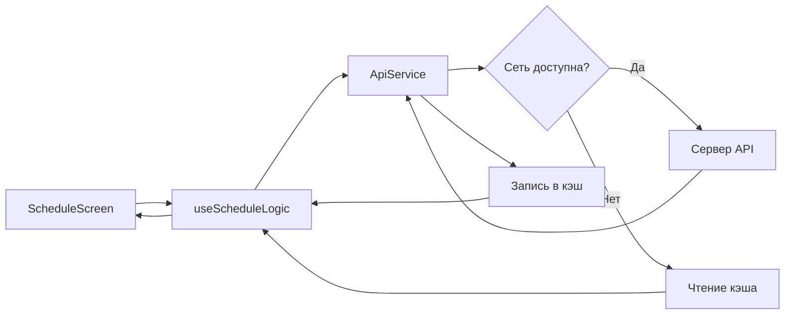
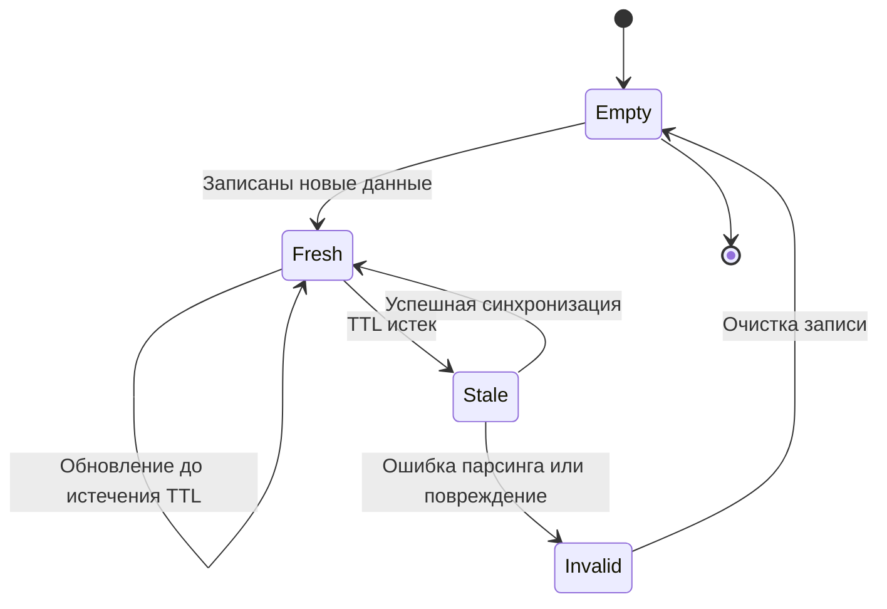
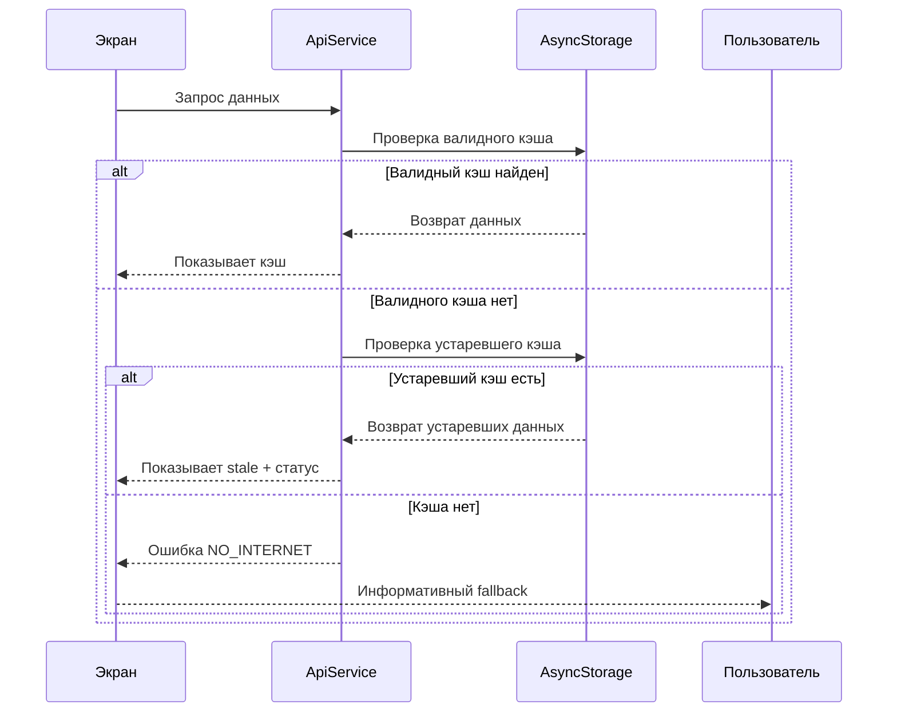

# Данные, API и хранилище

## Источники данных
Основной внешний источник данных обрабатывается через `utils/api.js`.

Потребители данных:
- расписание и связанные сущности (группы, недели, время пар);
- новости;
- вспомогательные данные для экранов.

## Принципы работы с API
- Любые изменения сетевой логики вносить в сервисный слой, а не в JSX.
- Не предполагать, что API всегда вернет валидные данные.
- Обрабатывать частичные и пустые ответы без падения UI.
- На ошибки сети всегда показывать понятный fallback.

## Кэширование
Кэш и TTL-логика централизованы в `utils/cache.js`.

Что важно:
- запись хранится как объект с `value` и `expiry`;
- невалидные и поврежденные записи удаляются;
- просроченный кэш очищается автоматически;
- есть защита от некорректно большого TTL.

Практический эффект:
- приложение устойчивее при нестабильной сети;
- уменьшается количество повторных запросов;
- критично поддерживать обратную совместимость структуры кэша.

## Локальное хранилище
Используются два типа хранения:
- `AsyncStorage`: некритичные и кэшируемые данные.
- `SecureStore`: чувствительные или важные настройки пользователя.

Типичные категории локальных данных:
- выбранные курс/группа;
- настройки уведомлений;
- кэш новостей и расписания;
- пользовательские заметки к занятиям.

Дополнительно используются:
- избранные расписания (`schedule_favorites`);
- отметки посещаемости (`attendance_*`) с учетом даты и типа занятия;
- снимки расписания для детекции изменений (`schedule_snapshot_*`);
- история изменений расписания (`schedule_changes_history_v1`);
- учебные события (`academic_events_v1`);
- учебный профиль (`study_profile_v1`);
- флаги видимости функций расписания (`attendance_tracking_enabled`, `free_auditories_enabled`).

## Совместимость данных
При изменении формата локальных данных:
1. Предусмотреть безопасный fallback для старых значений.
2. Не удалять старые ключи до подтверждения миграции.
3. Обрабатывать ошибки парсинга и отсутствующие поля.
4. Избегать silent-fail: логировать и возвращать безопасный результат.

## Offline-first поведение
Минимальные требования:
- экран должен оставаться работоспособным при пропадании сети;
- при наличии кэша пользователь получает данные с понятной маркировкой источника;
- при отсутствии кэша пользователь получает информативное состояние ошибки;
- после восстановления сети данные должны синхронизироваться без ручного восстановления состояния.

## Практический чеклист для изменений данных
- Проверена обработка `null`/`undefined`/пустых массивов.
- Проверены ошибки сети и ошибки парсинга.
- Проверена работа кэша после обновления формата данных.
- Проверено восстановление состояния после перезапуска приложения.

## Схема потока данных расписания

## Состояния кэша

## Последовательность fallback при оффлайне

## Таблица хранения (концептуально)

| Категория | Пример места хранения | Назначение | Требование к совместимости |
|---|---|---|---|
| Настройки уведомлений | SecureStore | Персональные параметры уведомлений | Обязательны значения по умолчанию |
| Выбранные параметры расписания | SecureStore | Курс, группа, предпочтения | Нельзя ломать чтение старых ключей |
| Кэш новостей и расписания | AsyncStorage | Offline-first и ускорение загрузки | TTL и очистка поврежденных записей |
| Заметки к занятиям | AsyncStorage | Пользовательские заметки | Нельзя терять данные при обновлении |
| Дедлайны ДЗ | AsyncStorage | Дедлайн, статус и локальное напоминание для ДЗ | Нужен fallback для старых заметок без даты |
| Избранные расписания | AsyncStorage | Быстрое переключение между сущностями | Стабильные ID для group/teacher/auditory |
| Посещаемость | AsyncStorage | Локальная статистика посещаемости | Ключ должен учитывать дату и тип пары |
| Снимки расписания | AsyncStorage | Уведомления об изменениях расписания | Изоляция по scope (день/неделя/сущность) |
| История изменений расписания | AsyncStorage | Отдельная лента изменений за последние 7 дней | Ограниченный rolling window и безопасный парсинг |
| Учебные события | AsyncStorage | Экзамены, зачеты, практика, каникулы и экспорт | Стабильная сортировка по дате |
| Учебный профиль | AsyncStorage | Персональные цели по посещаемости | Значения по умолчанию при отсутствии ключа |
| Фиче-флаги расписания | SecureStore | Скрытие/показ инструментов UI | Значения по умолчанию при отсутствии ключа |
