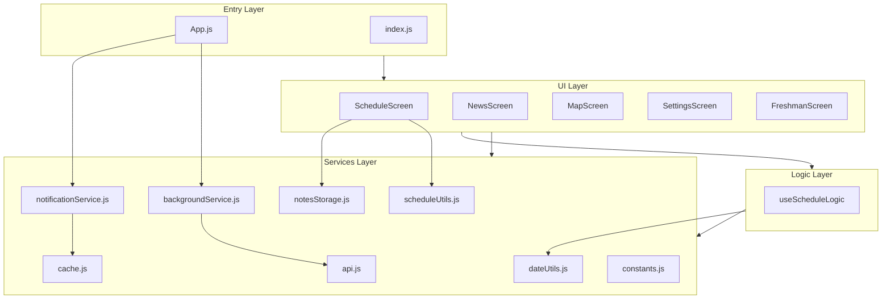
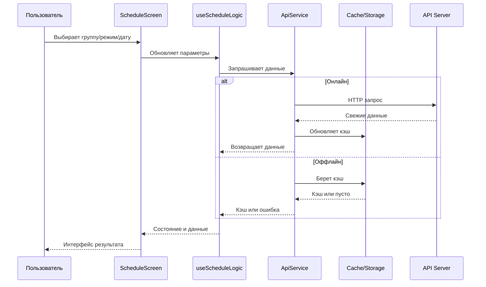
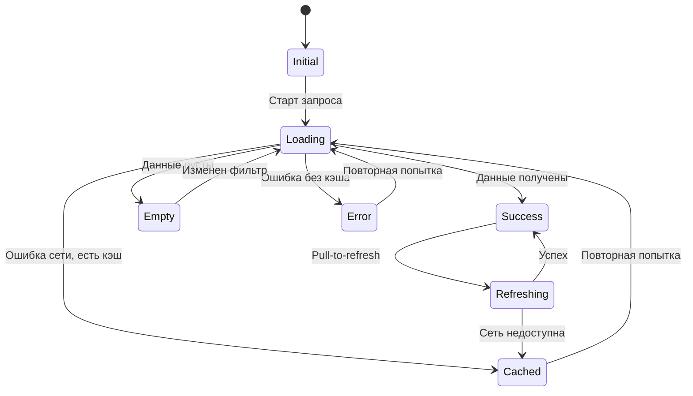
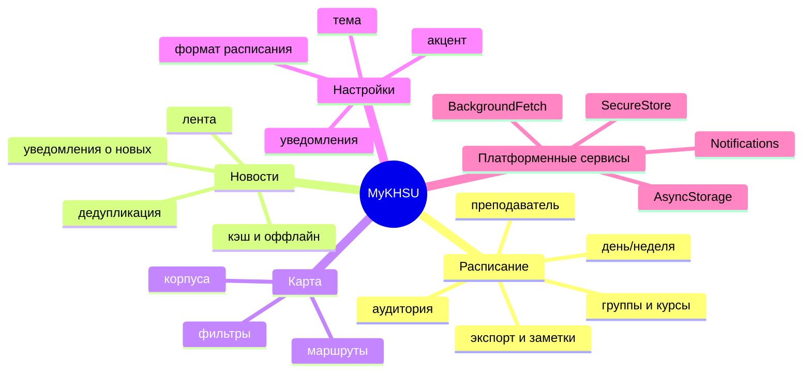
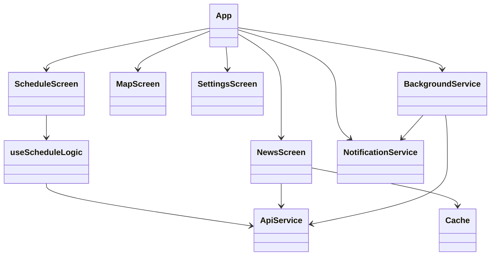

# Диаграммы и схемы проекта

Этот документ содержит визуальные схемы высокого уровня для быстрого понимания архитектуры, потоков данных и жизненных циклов ключевых подсистем.

## 1) Системная карта модулей

## 2) Путь данных для экрана расписания

## 3) Машина состояний экрана данных

## 4) Карта предметных областей

## 5) Зависимости ключевых сущностей

## Как использовать этот документ
1. Для быстрого онбординга: читать сверху вниз.
2. Для анализа изменений в расписании: использовать схемы 1, 2 и 3.
3. Для изменений уведомлений: сверяться с [notifications-and-background.md](notifications-and-background.md).
4. Для анализа архитектурного воздействия: сверяться с [architecture.md](architecture.md).
