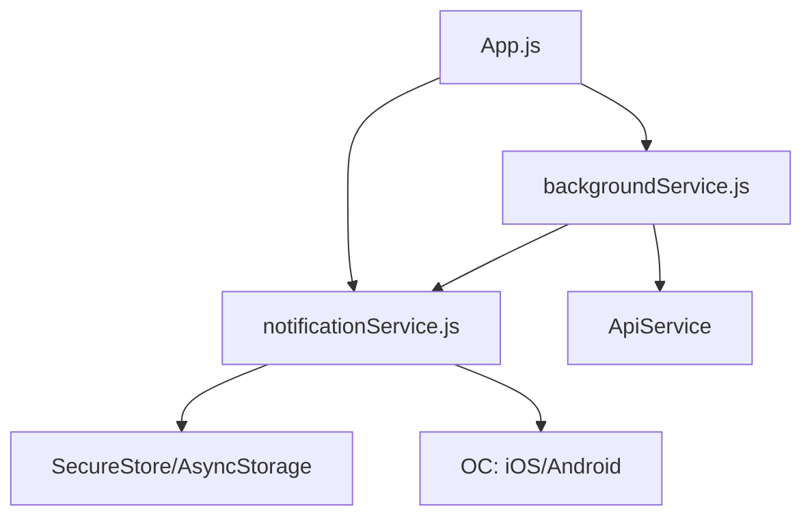
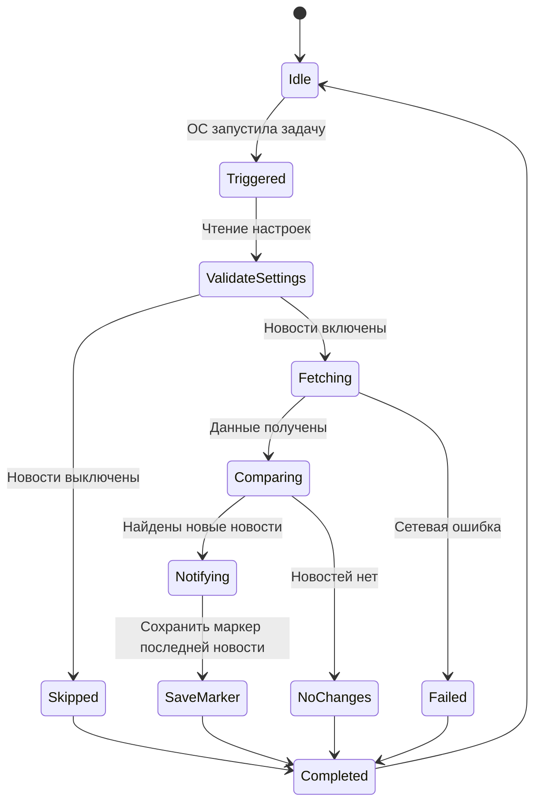
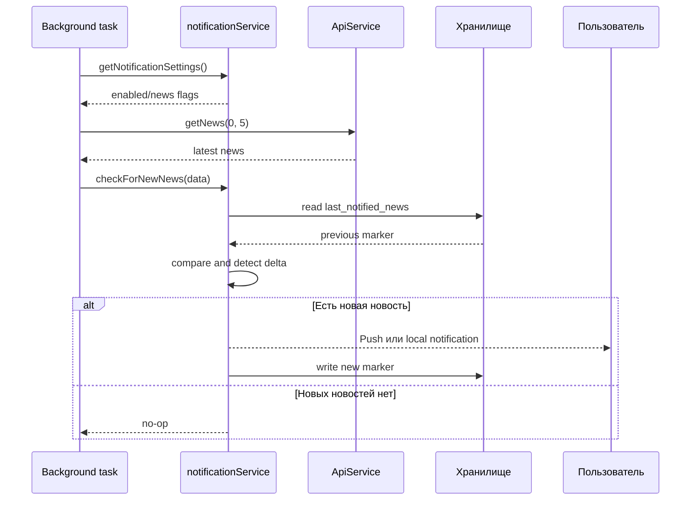

# Уведомления и фоновые задачи

## Компоненты подсистемы

- `utils/notificationService.js`: управление разрешениями, каналами, настройками и триггерами уведомлений.
- `utils/backgroundService.js`: регистрация и выполнение периодической фоновой проверки новостей.
- `utils/newsNotifications.js`: дополнительная логика, связанная с уведомлениями новостей.

## Базовый поток уведомлений

1. Приложение инициализирует обработчик уведомлений.
2. Запрашиваются системные разрешения.
3. На Android создаются каналы, например для расписания и новостей.
4. Настройки пользователя читаются из хранилища.
5. На основе настроек включаются или отключаются соответствующие сценарии уведомлений.

## Настройки уведомлений

Минимально ожидаемые параметры:

- включены ли уведомления в целом;
- новости;
- расписание;
- изменения расписания;
- события до, в начале, до конца и по окончании пары.

Дополнительные локальные сценарии:

- напоминания о дедлайнах ДЗ;
- напоминания об учебных событиях.

Требования к изменениям:

- не терять совместимость с уже сохраненными настройками;
- при отсутствии ключей использовать значения по умолчанию;
- не допускать ситуации, когда включенные настройки фактически игнорируются без причины.

## Уведомления об изменениях расписания

Логика детекции изменений в расписании должна быть консервативной и предсказуемой:

- проверка запускается только при разрешенных настройках уведомлений;
- для источников `cache` и `stale_cache` уведомления об изменениях не отправляются;
- сравнение выполняется по пересечению общих дней, чтобы переключение между днями не порождало ложные срабатывания;
- снимки расписания сохраняются отдельно по scope: день, неделя, сущность расписания.

## Фоновая проверка новостей

Фоновая задача определяется через Expo Task Manager.

Ожидаемое поведение:

- перед загрузкой новостей проверяются пользовательские настройки;
- если уведомления новостей выключены, задача завершается без побочных действий;
- при успешной загрузке выполняется проверка новых новостей;
- ошибки обрабатываются безопасно, без падения приложения.

## Платформенные ограничения

- Фоновые задачи могут вести себя по-разному на Android и iOS.
- Нельзя гарантировать строгое выполнение по расписанию на всех устройствах.
- Нельзя опираться на фоновую задачу как на единственный способ синхронизации данных.

## Риски и защита от регрессии

Риски:

- дублирование уведомлений;
- слишком частые проверки и лишний расход батареи;
- потеря уведомлений из-за некорректной проверки настроек;
- нестабильность при отказе разрешений.

Дополнительные риски для расписания:

- ложные уведомления при переключении между днями и кэшированными данными;
- сравнение неполных снимков расписания между разными scope.

Профилактика:

- идемпотентная логика проверки новых событий;
- строгая проверка настроек перед отправкой уведомлений;
- аккуратная обработка ошибок разрешений и сетевых ошибок;
- тестирование на реальном устройстве.

Для новых локальных напоминаний:

- перед постановкой напоминания явно проверять системное разрешение уведомлений;
- не планировать напоминание на дату в прошлом;
- при удалении дедлайна или события отменять связанное запланированное уведомление.

Дополнительно для расписания:

- фильтрация источников данных, включая игнорирование `cache` и `stale_cache`;
- хранение снимков расписания по изолированным ключам scope;
- сравнение только сопоставимых наборов данных, то есть общих weekdays.

## Минимальная ручная проверка

1. Включить и выключить уведомления в настройках.
2. Проверить, что состояние сохраняется после перезапуска.
3. Проверить отсутствие дублей уведомлений в типовом сценарии.
4. Проверить поведение при отключенной сети и после ее восстановления.

## Схема подсистемы уведомлений

## Жизненный цикл фоновой проверки новостей

## Последовательность отправки уведомления о новости

